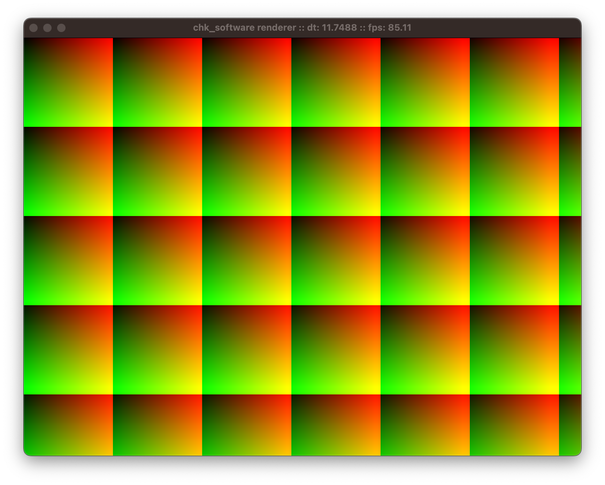

# chk_software
Software renderer written in C++

## Features
Support
- [x] Works on Windows 10+ (Tested on Windows 11, NVidia gtx 1660)
- [x] Works on Linux
- [x] Works on macOS (Tested on arm64 M1)

Windowing
- [x] Smooth resizing.
- [x] Maximizing, minimizing.
- [ ] Fullscreen toggling (Works on macOS, but not Windows).
- [ ] Mouse input
- [ ] Keyboard input
- [ ] Gamepad input

Rendering
- [x] Rendering is uninterrupted by resize operations.
- [x] Rendering is abstracted by a CommandList class.
- [x] Window can be recreated with or without a OpenGL context.
- [ ] Simple primitives rendered correctly
- [ ] Texture mapping
- [ ] Barycentric coordinates UV interpolation
- [ ] Small subset of GLSL shaders in software
- [ ] 3D Graphics (depth testing, camera matrices, etc)

Sound
- [ ] Simple audio mixer

## License
MIT